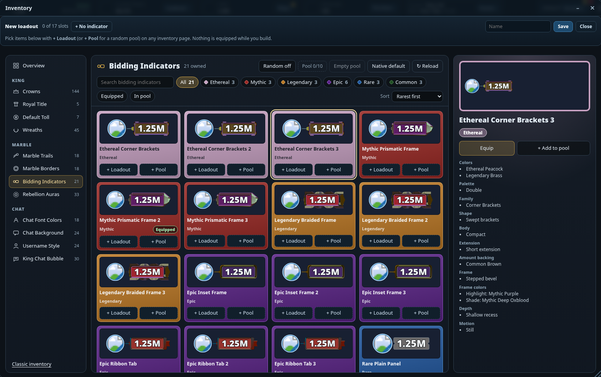
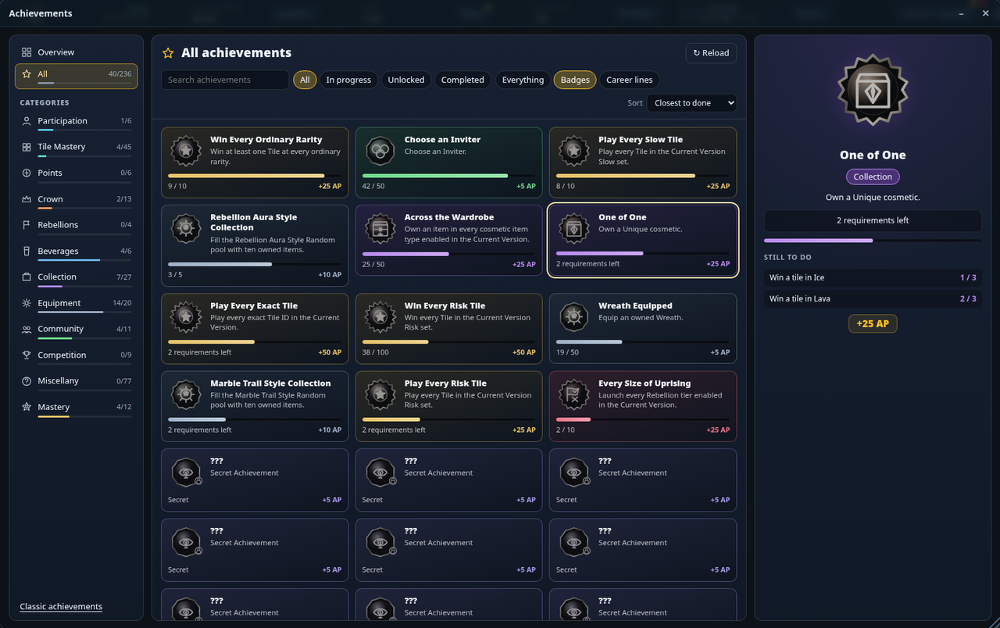

<div align="center">

# MarbleLuceFall

**A layout overhaul for [Marble Crownfall](https://marblecrownfall.com)** — tidier pages, quicker play and a look of your choice,
without taking anything away. Every change can be switched off, and the page is back to the original.

[](https://greasyfork.org/scripts/595115-marblelucefall)
[](https://greasyfork.org/scripts/595115-marblelucefall)
[](https://github.com/CuteLuciii/marbleluce-fall/releases/latest)
[](LICENSE)

[**Install**](#install) · [Features](#features) · [Privacy](#privacy-and-network) · [Source](#source-and-building) · [Releases](https://github.com/CuteLuciii/marbleluce-fall/releases) · [Feedback](#feedback)

</div>

---

| New inventory | New achievements page |
|:---:|:---:|
| [](docs/screenshots/inventory.png) | [](docs/screenshots/achievements.png) |

<sub>Screenshots taken with test data.</sub>

## Install

1. Install a userscript manager — [Tampermonkey](https://www.tampermonkey.net/) or [Violentmonkey](https://violentmonkey.github.io/).
2. Install MarbleLuceFall **[from Greasy Fork](https://greasyfork.org/scripts/595115-marblelucefall)** (recommended — updates arrive by themselves),
   or take `MarbleLuceFall.user.js` from the [latest release](https://github.com/CuteLuciii/marbleluce-fall/releases/latest).
3. Open [marblecrownfall.com](https://marblecrownfall.com). Click your name for the account menu, or the gear for the settings.

Works in Firefox (including Zen), Chrome, Edge and other Chromium browsers. A red dot on your account card tells you
within minutes when a new version is out.

## Features

<details open>
<summary><b>Look</b></summary>

- **50+ colour themes** — pride flags, games, gradients, patterns, random or rotating.
- **Deluxe themes** with their own scenery, animations and buttons:
  **Games** (Minecraft, Super Mario, Zelda, Tetris, Pac-Man, Portal, Sonic, Pokédex, Game Boy, Stardew Valley, Hollow Knight, World of Warcraft, Satisfactory, TARDIS, Casino) ·
  **Film & TV** (Star Wars, Back to the Future, Breaking Bad, Supernatural, Everything Everywhere All at Once, Vertigo, Cinema) ·
  **Books** (The Lost Bookshop, Reading Nook) ·
  **Music** (Die Ärzte, Linkin Park, Kraftklub, Goethes Erben, Samsas Traum, Prinz Pi).
- **Hide cosmetics** — all at once, per group or one by one, only for you.
- **Performance levels** and Deluxe effects (full, subtle, off) for slower machines, with a frame rate counter.

</details>

<details open>
<summary><b>Inventory, loadouts and achievements</b></summary>

- **New inventory** — categories on the left with an **Overview** of everything you wear; search, rarity chips,
  Equipped and In pool filters above the cards; every card in the colour of its rarity; a large preview with
  Equip and Pool on the right. Crowns show on your profile picture, as in the shop.
- **Loadouts** — build a loadout from + Loadout on the items, or save what you wear now; put it back on with one
  click. Covers every slot or just a few, can be shared as a code — also with the MarbleMind Discord bot.
- **New achievements page** — categories with progress, an Overview (AP, next reward, reward cycles, closest to
  done, recently unlocked, Public Chronicle), filters and sorting, and every milestone of a career line.
- The game's own pages stay one click away ("Classic inventory", "Classic achievements").

</details>

<details>
<summary><b>Bidding, the King tile and the throne</b></summary>

- **Unbid** in one click, **extra ticket chips**, and **autobid** with risk protection and allow- and blocklists for tiles.
- **King tile** — the game's reign read-outs to your liking, plus the toll and the King's VIP tier.
- **Attack when free** (opt-in), also again and again until you are King.
- **Rebellion and Royal Celebration** panels with every tier and a confirm click.
- **Beverage bar** and, opt-in, beverages poured by themselves when you take the crown.

</details>

<details>
<summary><b>Pages, header and windows</b></summary>

- **Pages as windows** — shop, inventory, dailies, profile and more open over the running game: move them,
  resize them at any edge, park them in a taskbar.
- **Header cards as signposts** — Gold opens the shop, the tileset card the schedule; the next tileset with its
  start time; a ticket history on the Tickets card.
- **Tileset name** over the board instead of a full-screen picture.

</details>

<details>
<summary><b>Chat</b></summary>

- **Enhanced chat** — fewer system lines, text sizes, grouped messages, a pop-out window.
- **Mentions** in gold, nicknames, **@ + Tab** to complete a name.
- **Tomato button** and **animal call button** beside Send; tomatoes thrown at you as one small line.
- **Twitch emotes** (opt-in) — only you see them.

</details>

<details>
<summary><b>Shop, dailies, sound and more</b></summary>

- **Quest alarm** in the shop, quest dots on Rebellion and beverages, euro prices beside diamond prices.
- **Claim all dailies** in one click — or, opt-in, by themselves.
- **Player gifts** — who you can still send Gold or Diamond gifts to this episode.
- **Music player** over the game's whole soundtrack, with a small player bar to drag anywhere.
- The game's own **sound and graphics** levels from the settings; **How-to** and **What's new** built in.

</details>

## Privacy and network

- **Purchases always go through the game's own buttons** — the script never buys anything by itself.
- Everything it shows comes from the page or the game's own endpoints, with these exceptions:
  | Request | Why | When |
  |---|---|---|
  | `update.greasyfork.org` (fallback: this repository) | the update notice | every 2 minutes while the tab is visible |
  | `frankfurter.dev` | USD → EUR rate for the euro prices | once a day; off with the euro prices |
  | `emotes.adamcy.pl`, `static-cdn.jtvnw.net` | Twitch emote names and pictures | only with Twitch emotes switched on |
- None of them sends anything but the request itself. Settings, loadouts and history stay in your browser.
- Every picture in the themes is drawn by the script itself — no logos, stills or fonts of the originals.

## Source and building

The script is kept in pieces under [`src/`](src/), one file per part of the game it touches. `node build.js` joins
them in the order of [`src/order.txt`](src/order.txt) into `MarbleLuceFall.user.js` — plain concatenation, no
dependencies, any current Node.js. The pieces share the script's one scope, so the order matters.

| Folder | What lives there |
|---|---|
| [`src/boot/`](src/boot/) | what runs at document-start: the socket reader, the crown list cache, the new inventory and achievements pages |
| [`src/core/`](src/core/) | settings, styles, windows, menus, footer, performance, start-up |
| [`src/themes/`](src/themes/) | the colour engine, the Deluxe skin kit and every Deluxe theme, the theme list |
| [`src/king/`](src/king/) | King tile, beverages, attack when free, the throne, Rebellion, Royal Celebration, toll field |
| [`src/header/`](src/header/) | header cards, tileset card and banner, ticket history |
| [`src/rail/`](src/rail/) | ticket rail, extra chips, autobid |
| [`src/chat/`](src/chat/) | chat rail, pop-out, enhanced chat, tomatoes, emotes |
| [`src/pages/`](src/pages/) | loadouts and inventory helpers, shop and dailies, player gifts, update check |
| [`src/panel/`](src/panel/) | settings window, help and changelog, sound, music player |

```bash
node build.js            # writes MarbleLuceFall.user.js
node build.js out.js     # or anywhere else
```

## Releases

Every version is a [GitHub release](https://github.com/CuteLuciii/marbleluce-fall/releases) with its notes and the
script attached; Greasy Fork picks each new version up from this repository within minutes. The full changelog is also
inside the script: account menu › What's new / Changelog.

## Feedback

Found a bug or have an idea? [Open an issue](https://github.com/CuteLuciii/marbleluce-fall/issues) — a screenshot
and the two versions from the footer (MCF build · MLF version) help a lot.

## License

[MIT](LICENSE) © DreamingLucie. MarbleLuceFall is a fan-made project and not affiliated with Marble Crownfall.
